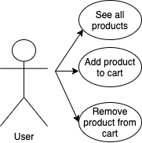
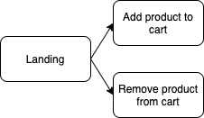
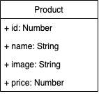

# promofarma-app

This small application shows a list of parapharmacy products, which the user can add to the cart. The price per product and the total price will appear in the basket. Also, you can remove products from the cart list.

The application is made whole with vanilla ECMAScript 5.

# 💊 Functional description 💊
- User can add a product to the cart
- User can remove a product from the cart

# 💊 Use-cases 💊

# 💊 Technical description 💊
## Flow chart

## Data model

## Trello link
[Trello](https://trello.com/b/eLjfOwAW/promofarma)
